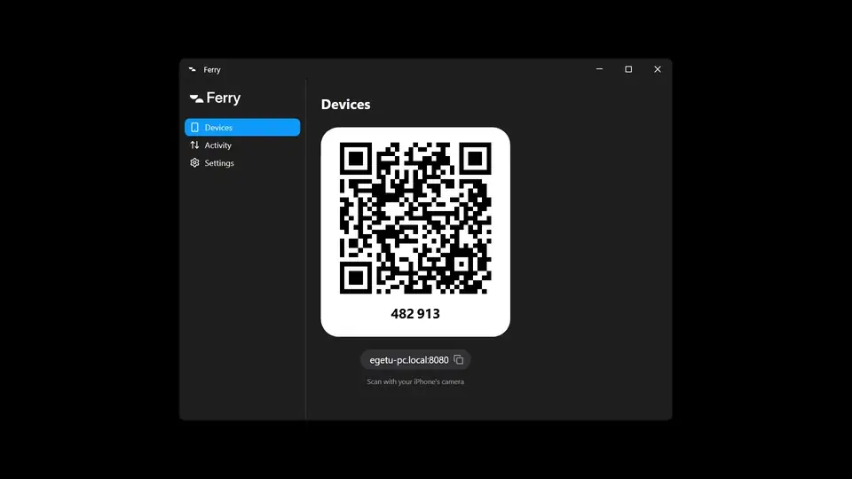

# Ferry

Files between your iPhone and your PC, over your own Wi-Fi.

[](https://github.com/1etu/ferry/actions/workflows/ci.yml) [](https://github.com/1etu/ferry/releases/latest) [](LICENSE)

[](https://1etu.github.io/ferry/)

## Contents

- [Install](#install)
- [Pair your iPhone](#pair-your-iphone)
- [Send and receive](#send-and-receive)
- [Originals](#originals)
- [Compared to others](#compared-to-others)
- [Security](#security)
- [Settings](#settings)
- [Updates](#updates)
- [Uninstall](#uninstall)
- [Build](#build)
- [License](#license)

## Install

1. Download [`Ferry.exe`](https://github.com/1etu/ferry/releases/latest/download/Ferry.exe) from the [latest release](https://github.com/1etu/ferry/releases/latest) (Windows 10 or 11).
2. Open it.
3. Click **Allow** when Windows Firewall asks.

Ferry is not code-signed, so the first run of each downloaded copy asks for confirmation. If Edge holds the download, click `…` › **Keep** › **Keep anyway**. If SmartScreen says "Windows protected your PC", click **More info** › **Run anyway**. Ferry then installs itself into `%LOCALAPPDATA%\Programs\Ferry`, adds a Start menu entry and starts with Windows.

## Pair your iPhone

1. Point the iPhone's Camera at the code in the Ferry window and tap the banner.
2. Click **Allow** on the PC.

Without a camera, open `http://<pc-name>.local:8080/` in Safari and type the code shown on the PC. To keep Ferry on the Home Screen, tap Share › **Add to Home Screen** within 24 hours of pairing; it opens paired, with no code.

## Send and receive

- **iPhone to PC:** tap **Send** and pick photos, videos or files.
- **PC to iPhone:** right-click files › **Send to** › **Send to iPhone** (on Windows 11, **Show more options** first), or **Send Files…** in the tray menu, or **Send** in the Ferry window. Tap the file on the iPhone to download it.

Received files land in `Downloads\Ferry` on the PC (change it in Settings) and in Files › Downloads on the iPhone.

## Originals

Ferry never recompresses anything: what the iPhone sends is what the PC writes. Videos arrive as stored. Photos depend on how you pick them:

- The Photo Library sends JPEG by default. For the stored HEIC, tap **Options** in the picker and choose **Current**.
- Location is removed unless you turn on **Location** in the same **Options** menu.
- **Choose File** (the Files app) sends files byte for byte.
- For JPEG everywhere instead, set Settings › Camera › Formats › **Most Compatible** on the iPhone.

## Compared to others

Measured, not estimated. Ferry, LocalSend and PairDrop each sent the same files from an emulated iPhone to a PC over a link shaped like good home Wi-Fi: 60 MB/s shared by every connection, 6 ms round trip.

```text
512 MB video                                  MB/s    time

LocalSend     ████████████████████████████    59.6   9.0 s
Ferry         █████████████████████████       53.4  10.1 s
PairDrop *    ███████████████████████         48.7  11.0 s

50 photos, 150 MB                             MB/s    time

Ferry         ████████████████████████████    56.1   2.8 s
PairDrop *    █████████████████████           42.4   3.7 s
LocalSend     ████████████████████            39.6   4.0 s

* PairDrop's fastest result on the same PC with no network at all.
  Its WebRTC channel tops out below the link, so real Wi-Fi can only be slower.
```

LocalSend fills the link with one large file. Ferry sends four files at a time, so bursts of photos finish sooner. With no network in between, LocalSend's native app is the fastest of the three:

| No network, same PC | Ferry | LocalSend | PairDrop |
|---|---|---|---|
| 512 MB video | 173 MB/s | 518 MB/s | 49 MB/s |
| 50 photos | 130 MB/s | 438 MB/s | 42 MB/s |

| | Ferry | LocalSend | PairDrop |
|---|---|---|---|
| App on the iPhone | No, it runs in Safari | Yes, from the App Store | No, it runs in the browser |
| Needs internet | No | No | Yes, unless you host its server |
| Account | No | No | No |
| Resumes a cut transfer | Yes | No ([open request](https://github.com/localsend/localsend/issues/1191)) | No |
| Encryption | iPhone to PC end to end, PC to iPhone unencrypted | TLS both ways | WebRTC (DTLS) both ways |
| Platforms | Windows and iPhone | Windows, macOS, Linux, Android, iOS | Any modern browser |
| License | MIT | Apache-2.0 | GPL-3.0 |

How this was measured, on one Windows 11 PC on 5 October 2026:

- **Apps:** Ferry 1.0.0, LocalSend 1.18.2 (its Windows app receiving, a sender speaking its protocol over mutual TLS and sending one file at a time like its app), and PairDrop 1.11.2 (its own server run locally, two Chromium browsers over WebRTC).
- **The iPhone:** Chromium with iPhone 15 emulation. Ferry's phone side is its real web app, encryption included.
- **Runs:** five measured runs after one warm-up per case; the median is shown. The files are random, so nothing compresses.
- **What it can't show:** Safari's JavaScript speed, iOS power management and a real Wi-Fi radio. iCloud Drive and a USB cable need a real iPhone and an Apple Account, so they are not measured here.

## Security

- **Nothing leaves your network.** Ferry talks only between the phone and the PC on the same Wi-Fi, plus one HTTPS request a day to GitHub for updates (off in Settings).
- **Only devices you approve.** Every phone is approved on the PC; approval can be revoked.
- **Encrypted from iPhone to PC.** What the phone sends is encrypted end to end with a key that only that phone and that PC hold, and every piece is verified before it is written. File names are encrypted in both directions.
- **Verified updates.** Updates are signed; Ferry installs only what the key in it can verify.

Files sent from the PC to the phone travel unencrypted on your Wi-Fi; and someone who controls your Wi-Fi, not just listens to it, could alter the Ferry page your phone loads. Use a network you trust for things you would not say out loud on it.

With Lockdown Mode on, iPhone uploads run at a few MB/s, because iOS disables the JavaScript JIT that Ferry's encryption needs.

Threat model and reporting: [SECURITY.md](SECURITY.md).

## Settings

- **Name:** the PC's name as the iPhone shows it.
- **Start at Login:** on by default, so Ferry is there after a restart.
- **Received Files:** the folder incoming files go to.
- **Check Automatically:** the daily update check.
- **Ferry *version*:** **Check for Updates**, or **Restart to Update** when one is ready.

`port`, `maxUploadBytes`, `reserveBytes` and `maxActiveUploadsPerDevice` live in `%LOCALAPPDATA%\Ferry\config.json`; edit it while Ferry is not running.

## Updates

Once a day, starting a minute after launch, Ferry fetches the latest release's manifest from GitHub. It installs an update only if the manifest's signature verifies against the key built into Ferry and the download matches the manifest's size and SHA-256; older versions are refused. **Check for Updates** in Settings checks now, and **Check Automatically** turns the daily check off. When an update is ready, **Restart to Update** in Settings or the tray installs it.

## Uninstall

Windows Settings › Apps › Installed apps › Ferry › **Uninstall**, or run `Ferry.exe uninstall`. This removes the program, its shortcuts and `%LOCALAPPDATA%\Ferry`. Received files stay.

## Build

Go 1.27.1, Node 22 and pnpm 10. Commands are for Git Bash or any POSIX shell.

```sh
pnpm -C web install
pnpm -C web build && CGO_ENABLED=0 go build -o bin/Ferry.exe ./cmd/ferry
```

A build without `-ldflags "-X main.version=<version>"` is a dev build: it neither installs itself nor updates.

Development, with the API on port 8080 and Vite in front of it:

```sh
FERRY_DEV=1 go run ./cmd/ferry
pnpm -C web dev
```

| Variable | Effect |
|---|---|
| `FERRY_DATA_DIR` | Data directory instead of `%LOCALAPPDATA%\Ferry` |
| `FERRY_PORT` | Port instead of the one in `config.json` |
| `FERRY_HEADLESS=1` | No tray and no window |
| `FERRY_DEV=1` | Trusts the Vite proxy, relaxes the port check, logs text to stderr |

Checks, tests and the rules CI enforces are in [CONTRIBUTING.md](CONTRIBUTING.md).

## License

[MIT](LICENSE)
